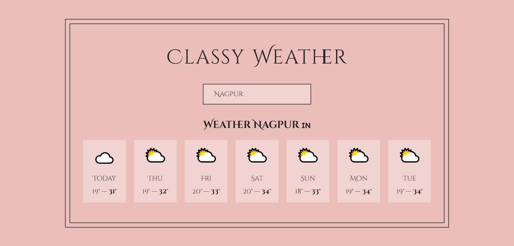

# Check Weather App - React

## About Check Weather

Check Weather is your go-to web app for real-time weather updates worldwide. I've built it with efficiency in mind using [Vite](https://vitejs.dev/) and rely on trusted weather APIs to keep you informed accurately, whether you're planning a trip, checking hometown weather, or just staying updated.

## 🚀 Live Demo

[https://check-weather-forecast.vercel.app/](https://check-weather-forecast.vercel.app/)

## # Screenshot

## How to Install

To get Classy Weather up and running on your local machine, follow these simple steps:

1. Clone the Repository:

   1. Clone the repository: `https://github.com/SwapnilJambhulkar/check-weather.git`
   2. Navigate to the project directory: `cd Classy-weather-app`

2. Install Dependencies:

   You'll need Node.js and npm installed on your computer. Once you have them, run:

   `npm install`

## How to Use

Here's how you can start using Classy Weather:

3. Launch the Development Server:

   Start the development server to run Classy Weather locally: `npm run dev`

   Then you can access the app in your web browser by going to `http://localhost:3000`

### yep! 🙌
